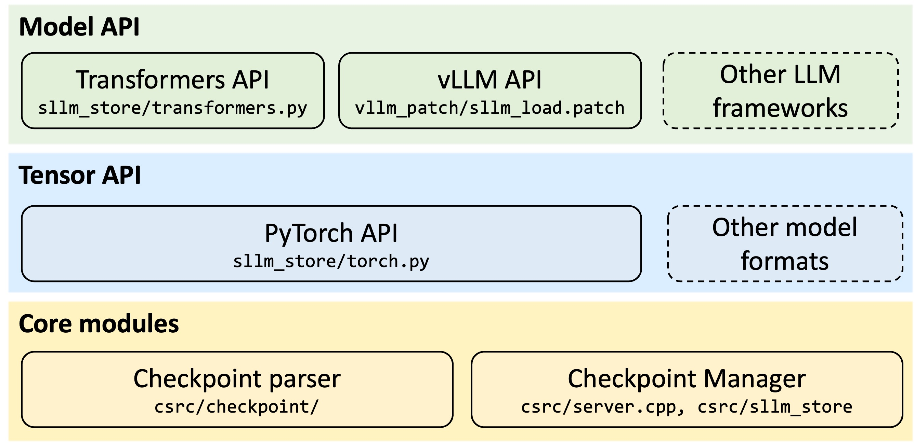

<p align="center">
  <picture>
    
  </picture>
</p>

<h1 align="center">ServerlessLLM</h1>

<p align="center">
  <strong>Load models 10x faster. Serve 10 models with 1 GPU.</strong>
</p>

<p align="center">
  <a href="https://pypi.org/project/serverless-llm/"></a>
  <a href="https://pypi.org/project/serverless-llm/"></a>
  <a href="https://discord.gg/AEF8Gduvm8"></a>
  <a href="./docs/images/wechat.png"></a>
  <a href="LICENSE"></a>
</p>

<p align="center">
  <a href="https://serverlessllm.github.io"><b>Docs</b></a> •
  <a href="#-quick-start-90-seconds"><b>Quick Start</b></a> •
  <a href="https://www.usenix.org/conference/osdi24/presentation/fu"><b>OSDI'24 Paper</b></a>
</p>

---

## ⚡ Performance

<p align="center">
  
</p>

**ServerlessLLM loads models 5-10x faster than SafeTensors/PyTorch**, enabling true serverless LLM deployment where multiple models share GPU resources efficiently.

| Model | Size | PyTorch | SafeTensors | ServerlessLLM | Speedup |
|-------|------|-------------|---------------|---------------|---------|
| DeepSeek-OCR | 6.67GB | TBD | TBD | TBD | **~7x** |
| GPT-oss | 13.8GB | TBD | TBD | TBD | **~7x** |
| Qwen3-Next | 163GB | TBD | TBD | TBD | **~8x** |

*Detailed benchmark results coming soon. Tested on NVIDIA A100 GPU with NVMe SSD.*

---

## 🎬 See It in Action

<p align="center">
  
</p>

<p align="center">
  <em>From zero to serving in 90 seconds: docker compose up → deploy model → query with OpenAI API</em>
</p>

---

## What is ServerlessLLM?

ServerlessLLM is a fast, low-cost system for deploying multiple LLMs on shared GPUs. Three core innovations make this possible:

1. **⚡ Ultra-Fast Checkpoint Loading**: Custom storage format with O_DIRECT I/O loads models 5-10x faster than standard methods
2. **🔄 GPU Multiplexing**: Multiple models share GPUs with intelligent scheduling and live migration
3. **🎯 Unified Inference + Fine-Tuning**: First system to seamlessly integrate LLM serving with LoRA fine-tuning on shared resources

**Result:** Serve 10 models with 1 GPU, fine-tune on-demand, and serve base + 100s of LoRA adapters. Save 40-60% on infrastructure costs.

---

## 🚀 Quick Start (90 Seconds)

### Start ServerlessLLM Cluster

```bash
# Download the docker-compose.yml file
curl -O https://raw.githubusercontent.com/ServerlessLLM/ServerlessLLM/main/examples/docker/docker-compose.yml

# Set model storage location
export MODEL_FOLDER=/path/to/models

# Launch cluster (head node + worker with GPU)
docker compose up -d
```

### Deploy a Model

```bash
docker exec sllm_head sllm deploy Qwen/Qwen3-0.6B --backend transformers
```

### Query the Model

```bash
curl http://127.0.0.1:8343/v1/chat/completions \
  -H "Content-Type: application/json" \
  -d '{
    "model": "Qwen/Qwen3-0.6B",
    "messages": [{"role": "user", "content": "What is ServerlessLLM?"}],
    "temperature": 0.7
  }'
```

**That's it!** Your model is now serving requests with OpenAI-compatible API.

---

## 💡 Use the Fast Loader in Your Code

ServerlessLLM Store can be used standalone to speed up model loading in any PyTorch/Transformers project.

### Install

```bash
pip install serverless-llm-store
```

### Convert a Model

```python
from sllm_store.transformers import save_model
from transformers import AutoModelForCausalLM

# Load and convert model
model = AutoModelForCausalLM.from_pretrained('Qwen/Qwen3-0.6B')
save_model(model, './models/Qwen/Qwen3-0.6B')
```

### Load 5-10x Faster

```bash
# Start the store server first
sllm-store start --storage-path ./models --mem-pool-size 4GB
```

```python
from sllm_store.transformers import load_model

# Load model (5-10x faster than from_pretrained!)
model = load_model(
    "Qwen/Qwen3-0.6B",
    device_map="auto",
    torch_dtype="float16"
)

# Use as normal PyTorch/Transformers model
output = model.generate(**inputs)
```

**How it works:**
- Custom binary format optimized for sequential reads
- O_DIRECT I/O bypassing OS page cache
- Pinned memory pool for DMA-accelerated GPU transfers
- Parallel multi-threaded loading

---

## 🏗️ Architecture

<p align="center">
  
</p>

**Key Features:**
- **Storage-Aware Scheduling**: Places models near their checkpoints for fastest loading
- **Live Migration**: Move running models between GPUs without dropping requests
- **Auto-Scaling**: Scale instances up/down based on traffic
- **Multi-Backend**: vLLM, HuggingFace Transformers, LoRA fine-tuning

---

## 🎯 Features & Examples

### ⚡ Ultra-Fast Model Loading
- **5-10x faster** than SafeTensors and PyTorch checkpoint loaders
- Custom O_DIRECT I/O format optimized for sequential reads
- Parallel loading with pinned memory pools
- Works with vLLM, Transformers, and custom models

**📖 Docs:** [Fast Loading Guide](https://serverlessllm.github.io/docs/store/quickstart) | [ROCm Guide](https://serverlessllm.github.io/docs/store/rocm_quickstart)

---

### 🔄 GPU Multiplexing
- **Run 10+ models on 1 GPU** with fast switching
- Storage-aware scheduling minimizes loading time
- Auto-scale instances per model (scale to zero when idle)
- Live migration for zero-downtime resource optimization

**📖 Docs:** [Deployment Guide](https://serverlessllm.github.io/docs/deployment)

**💡 Example:** Multi-Node Cluster
```bash
# See examples/storage_aware_scheduling
docker compose up -d  # Starts 2-worker cluster with intelligent placement
```

---

### 🎯 Unified Inference + Fine-Tuning
- **First system** to integrate LLM serving with serverless fine-tuning
- Submit LoRA fine-tuning jobs via OpenAI-compatible API
- Automatic resource scheduling for training jobs
- Serve base model + 100s of LoRA adapters efficiently
- Fine-tuned adapters auto-deploy for inference

**📖 Docs:** [Fine-Tuning Guide](https://serverlessllm.github.io/docs/fine_tuning)

**💡 Example:** Submit LoRA Fine-Tuning Job
```bash
curl $LLM_SERVER_URL/v1/fine-tuning/jobs \
  -d '{
    "model": "facebook/opt-125m",
    "backend": "peft_lora",
    "dataset": "fka/awesome-chatgpt-prompts",
    "lora_config": {"r": 4, "lora_alpha": 32}
  }'
```

---

### 🔍 Embedding Models for RAG
- Deploy embedding models alongside LLMs
- OpenAI-compatible `/v1/embeddings` endpoint
- Efficient batching and caching

**💡 Example:** Deploy Embedding Model
```bash
sllm deploy sentence-transformers/all-MiniLM-L12-v2 \
  --backend transformers \
  --num-gpus 0.5

curl $LLM_SERVER_URL/v1/embeddings \
  -d '{"model": "sentence-transformers/all-MiniLM-L12-v2", "input": ["text"]}'
```

---

### 🚀 Production-Ready
- **OpenAI-compatible API** (drop-in replacement)
- Docker and Kubernetes (coming soon) deployment
- Multi-node clusters with distributed scheduling
- Request tracing, health checks, and graceful shutdown

**📖 Docs:** [Deployment Guide](https://serverlessllm.github.io/docs/deployment) | [API Reference](https://serverlessllm.github.io/docs/api)

---

### 💻 Supported Hardware
- **NVIDIA GPUs**: CUDA 11.8+ (A100, H100, RTX series)
- **AMD GPUs**: ROCm 6.2+ (MI100, MI200 series) - Experimental

**More Examples:** [./examples/](./examples/)

---

## 📖 Documentation

- **[Getting Started Guide](https://serverlessllm.github.io/docs/getting_started)** - Complete setup tutorial
- **[Fast Loading Guide](https://serverlessllm.github.io/docs/store/quickstart)** - Use sllm-store standalone
- **[CLI Reference](https://serverlessllm.github.io/docs/cli)** - All commands
- **[API Reference](https://serverlessllm.github.io/docs/api)** - Python APIs
- **[Deployment Guide](https://serverlessllm.github.io/docs/deployment)** - Kubernetes, multi-node

---

## 🤝 Community

- **Discord**: [Join our community](https://discord.gg/AEF8Gduvm8) - Get help, share ideas
- **GitHub Issues**: [Report bugs](https://github.com/ServerlessLLM/ServerlessLLM/issues)
- **WeChat**: [QR Code](./docs/images/wechat.png) - 中文支持
- **Contributing**: See [CONTRIBUTING.md](./CONTRIBUTING.md)

Maintained by 10+ contributors worldwide. Community contributions welcome!

---

## 📄 Citation

If you use ServerlessLLM in your research, please cite our [OSDI'24 paper](https://www.usenix.org/conference/osdi24/presentation/fu):

```bibtex
@inproceedings{fu2024serverlessllm,
  title={ServerlessLLM: Low-Latency Serverless Inference for Large Language Models},
  author={Fu, Yao and Xue, Leyang and Huang, Yeqi and Brabete, Andrei-Octavian and Ustiugov, Dmitrii and Patel, Yuvraj and Mai, Luo},
  booktitle={OSDI'24},
  year={2024}
}
```

---

## 📝 License

Apache 2.0 - See [LICENSE](./LICENSE)

---

<p align="center">
  <strong>⭐ Star this repo if ServerlessLLM helps you!</strong>
</p>
