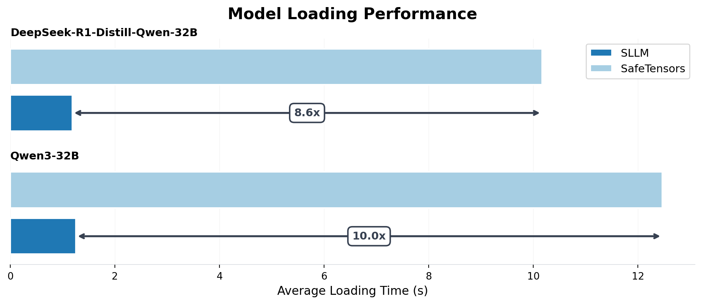
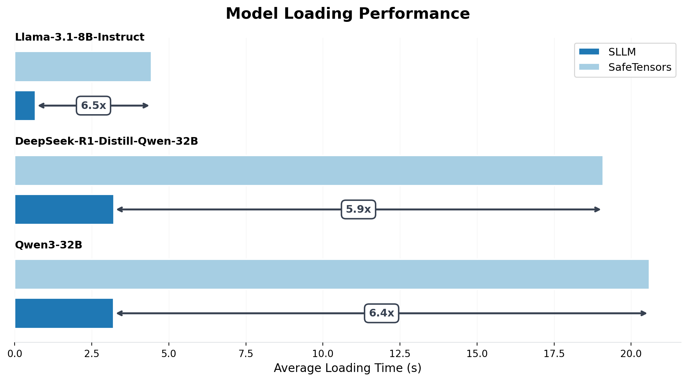

# ServerlessLLM Store Benchmarks

A benchmarking suite to measure the model loading performance of ServerlessLLM Store against baselines.

## Latest Benchmark Results: 6-10x Speedup over SafeTensors

#### Cached Benchmark (5 runs per model)

Measures performance when loading the same model repeatedly.

| Model | Format | Avg (s) | Min (s) | Max (s) | Std Dev | Speedup |
|-------|--------|---------|---------|---------|---------|---------|
| Qwen/Qwen3-32B | SLLM | 1.253 | 1.165 | 1.508 | 0.144 | **9.95x** |
| Qwen/Qwen3-32B | SafeTensors | 12.466 | 12.382 | 12.591 | 0.097 | - |
| DeepSeek-R1-Distill-Qwen-32B | SLLM | 1.184 | 1.169 | 1.207 | 0.016 | **8.58x** |
| DeepSeek-R1-Distill-Qwen-32B | SafeTensors | 10.165 | 9.973 | 10.324 | 0.134 | - |



#### Random Multi-Model Benchmark (30 runs)

Simulates real-world serving scenarios where different model copies are loaded in random order.

| Model | Format | Avg (s) | Min (s) | Max (s) | Std Dev | Speedup |
|-------|--------|---------|---------|---------|---------|---------|
| Qwen/Qwen3-32B | SLLM | 3.216 | 2.194 | 3.539 | 0.202 | **6.40x** |
| Qwen/Qwen3-32B | SafeTensors | 20.592 | 17.880 | 28.763 | 2.535 | - |
| DeepSeek-R1-Distill-Qwen-32B | SLLM | 3.220 | 2.503 | 3.425 | 0.141 | **5.93x** |
| DeepSeek-R1-Distill-Qwen-32B | SafeTensors | 19.090 | 17.661 | 23.704 | 1.248 | - |
| Llama-3.1-8B-Instruct | SLLM | 0.678 | 0.657 | 0.704 | 0.011 | **6.54x** |
| Llama-3.1-8B-Instruct | SafeTensors | 4.437 | 2.720 | 6.257 | 0.895 | - |



### All Benchmark Results in Detail

- [H100 SXM Results (Dec 2025)](results/h100_2025/)
- [A5000 Results (2024)](results/a5000_2024/)

## Running Benchmarks

### Quick Start

Choose your deployment method:

```bash
# Bare Metal - run directly with sllm-store running
./run-benchmark.sh --model-name facebook/opt-6.7b --benchmark-type random

# Docker - containerized execution
./deploy/docker/run.sh --model-name facebook/opt-6.7b

# Kubernetes - see deploy/k8s/README.md
kubectl apply -f deploy/k8s/configmap.yaml -f deploy/k8s/job.yaml
```

### Benchmark Types

| Type | Description | Use Case |
|------|-------------|----------|
| `random` | Loads N different model copies in random order | Simulates multi-model serving scenarios |
| `cached` | Loads the same model N times | Measures cache/storage performance |

```bash
# Random benchmark (default)
./run-benchmark.sh --benchmark-type random --num-replicas 30

# Cached benchmark
./run-benchmark.sh --benchmark-type cached --num-replicas 5
```

### Common Options

| Flag | Default | Description |
|------|---------|-------------|
| `--model-name` | `facebook/opt-6.7b` | Model to benchmark |
| `--num-replicas` | `30` | Number of iterations |
| `--mem-pool-size` | `32GB` | sllm-store memory pool |
| `--benchmark-type` | `random` | Test type (random/cached) |
| `--storage-path` | `./models` | Model storage directory |
| `--results-path` | `./results` | Results output directory |
| `--generate-plots` | `false` | Generate visualizations |

## Deployment Methods

### Bare Metal

Requires `sllm-store` to be installed. The script automatically handles starting and stopping the server:

```bash
# Ensure models directory exists
mkdir -p ./models

# Run benchmark (starts sllm-store automatically)
./run-benchmark.sh \
    --model-name facebook/opt-6.7b \
    --benchmark-type random \
    --num-replicas 30
```

Results are saved to `./results/` by default.

### Docker

Use the official `serverlessllm/sllm` image:

```bash
./deploy/docker/run.sh --model-name facebook/opt-6.7b

# With gated model
./deploy/docker/run.sh \
    --model-name meta-llama/Meta-Llama-3-8B \
    --hf-token $HF_TOKEN

# Custom GPU and storage
./deploy/docker/run.sh \
    --gpu-limit 2 \
    --storage-path /mnt/nvme \
    --num-replicas 50
```

See [deploy/docker/README.md](deploy/docker/README.md) for details.

### Kubernetes

Deploy using standard `kubectl` commands:

```bash
# Create scripts ConfigMap
kubectl create configmap benchmark-scripts \
    --from-file=run-benchmark.sh \
    --from-file=download_models.py \
    --from-file=test_loading.py \
    --from-file=benchmark_utils.py \
    --from-file=generate_report.py

# Apply config and job
kubectl apply -f deploy/k8s/configmap.yaml
kubectl apply -f deploy/k8s/job.yaml

# Monitor
kubectl logs -f job/sllm-benchmark
```

See [deploy/k8s/README.md](deploy/k8s/README.md) for details.


## Output

Results are saved to `--results-path`:

- `summary.txt` - Human-readable summary
- `summary.json` - Machine-readable statistics
- `*_{format}_{replicas}_{type}.json` - Raw benchmark data
- `benchmark.log` - Full execution log

## Plotting Results

Generate visualizations with statistics:

```bash
python plot.py \
    --models facebook/opt-6.7b meta-llama/Meta-Llama-3-8B \
    --test-name random \
    --num-repeats 30 \
    --results-dir results/h100_2025/random \
    --output-filename images/loading_latency.png
```

The script prints detailed statistics including:
- Average, min, max, and standard deviation for both SLLM and SafeTensors
- Speedup comparison

## Directory Structure

```
benchmarks/
├── run-benchmark.sh          # Main orchestration script
├── plot.py                   # Visualization and statistics
├── deploy/
│   ├── docker/run.sh         # Docker launcher
│   └── k8s/                  # Kubernetes YAML templates
├── results/                  # Versioned benchmark results
│   ├── h100_2025/           # Latest H100 SXM results
│   └── a5000_2024/          # Previous A5000 results
└── docs/                     # Detailed documentation
```

## Contact

Questions? Contact [Y.Fu@ed.ac.uk](mailto:y.fu@ed.ac.uk) or open a GitHub issue.
