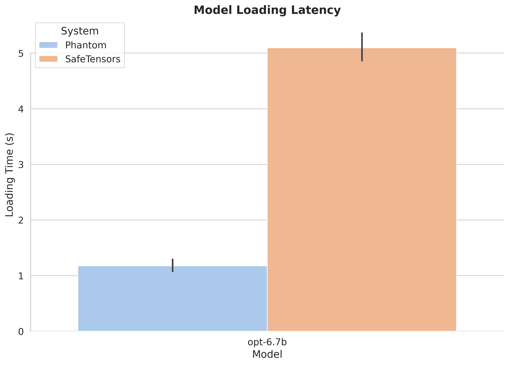

# Benchmarking for ServerlessLLM Store

Welcome to the benchmarking suite for ServerlessLLM Store. This suite is designed to measure the model loading performance of ServerlessLLM Store and compare it against several baselines on a variety of State-of-the-Art Large Language Models (LLMs).

## Quick Start: Automated Benchmarks

**NEW:** Run end-to-end benchmarks automatically with a single command.

```bash
# Docker (default: facebook/opt-6.7b, 30 replicas, 32GB memory pool)
cd benchmarks && ./docker-run.sh

# Gated models require HF token
./docker-run.sh --model-name meta-llama/Meta-Llama-3-8B --hf-token $HF_TOKEN

# Customize with command-line flags
./docker-run.sh --model-name meta-llama/Meta-Llama-3-8B --num-replicas 50

# Test cached load (single model, repeated loads)
./docker-run.sh --model-name facebook/opt-6.7b --benchmark-type cached

# Control GPU allocation (default: 1 GPU)
./docker-run.sh --gpu-limit 2                           # Use 2 GPUs
./docker-run.sh --gpu-limit "all"                       # Use all GPUs
./docker-run.sh --gpu-limit '"device=0"'                # Use specific GPU

# Full example with multiple options
./docker-run.sh \
    --model-name facebook/opt-6.7b \
    --num-replicas 30 \
    --mem-pool-size 64GB \
    --gpu-limit 2

# See all options
./docker-run.sh --help

# Kubernetes
kubectl apply -f k8s/benchmark-configmap.yaml
kubectl apply -f k8s/benchmark-job.yaml
```

**Two-way comparison**: Benchmarks compare **SLLM** and **SafeTensors** formats automatically.

See [BENCHMARK.md](BENCHMARK.md) for details.

## Table of Contents

- [Quick Start: Automated Benchmarks](#quick-start-automated-benchmarks) **← NEW**
- [Hardware Requirements](#hardware-requirements)
- [Prerequisites](#prerequisites)
- [Setting Up the Environment](#setting-up-the-environment)
- [Running the Benchmarks](#running-the-benchmarks)
  - [1. Random Multi-Model Load Test](#1-random-multi-model-load-test)
    - [1.1 Small Models](#11-small-models)
    - [1.2 Large Models](#12-large-models)
  - [2. Cached Single-Model Load Test](#2-cached-single-model-load-test) **← NEW**
    - [2.1 Small Models](#21-small-models)
    - [2.2 Large Models](#22-large-models)
- [Contact](#contact)

## Hardware Requirements

To ensure optimal performance and reliability of the ServerlessLLM Store benchmarking tests, we recommend the following hardware setup:

- **RAM:** A minimum of 32GB is required for small model tests. For large model tests, at least 150GB of RAM is recommended to effectively manage the pinned memory pool utilized by the ServerlessLLM Store server.

- **GPU:** An NVIDIA GPU with at least 24GB of VRAM is necessary for small model tests. For large model tests, a setup with at least 160GB of available VRAM is essential to handle the extensive model parameters.

- **Storage:** A minimum of 500GB of disk space is required for small model tests, while at least 1.5TB is necessary for large model tests. Utilizing an NVMe SSD is highly recommended for its superior bandwidth, which is critical for optimizing ServerlessLLM Store's performance.

The specifications used to obtain the following benchmark results are detailed in [this document](./server-specs.md).


## Prerequisites

Before running the benchmarks, ensure the following dependencies are installed:

```bash
pip install seaborn matplotlib pandas sentencepiece
```

Additionally, you will need to log in to the Hugging Face CLI to enable loading models such as meta-llama/Meta-Llama-3-8B:

```bash
huggingface-cli login
```

## Setting Up the Environment

Create a directory to store the models and establish a symbolic link to it. We highly recommend using a fast storage device such as an NVMe SSD to store the models:
```bash
mkdir /mnt/raid0nvme1/models
ln -s /mnt/raid0nvme1/models models
```

Optionally, you can install the Flexible I/O Tester (FIO) to benchmark the storage device's performance:
```bash
apt install fio
fio fio-config.ini
```

## Running the Benchmarks

### 1. Random Multi-Model Load Test

The random load test emulates **model serving scenarios** (such as Serverless LLM Inference), where a variety of different models are requested in random order, simulating a real-world use case.

#### 1.1 Small Models

Start the ServerlessLLM Store server with a 32GB memory pool:

```bash
sllm-store start --chunk-size=16MB --mem-pool-size=32GB --num-thread=4 --storage-path=./models
```

In a separate terminal, run the following commands to benchmark the loading performance of several small models. We repeat each test 30 times to ensure statistical stability:
```bash
CUDA_VISIBLE_DEVICES=0 bash benchmark_random_load.sh facebook/opt-6.7b ./models 30
CUDA_VISIBLE_DEVICES=0 bash benchmark_random_load.sh meta-llama/Meta-Llama-3-8B ./models 30
CUDA_VISIBLE_DEVICES=0 bash benchmark_random_load.sh mistralai/Mistral-7B-v0.3 ./models 30
CUDA_VISIBLE_DEVICES=0 bash benchmark_random_load.sh google/gemma-7b ./models 30
```

**Note**: The benchmark script tests both SLLM and SafeTensors formats automatically, providing a comprehensive comparison of model loading performance.

Plot the results with the following command, saving the output for review and documentation:

```bash
python plot.py --models facebook/opt-6.7b meta-llama/Meta-Llama-3-8B mistralai/Mistral-7B-v0.3 google/gemma-7b \
--test-name random --num-repeats 30 --results-dir results --output-file images/random_small_loading_latency.png
```

Here is an example of the output visualization:



#### 1.2 Large Models

Restart the ServerlessLLM Store server with an increased memory pool size to accommodate large models. Please note that the server startup can be lengthy due to the initialization of a 140GB memory pool:

```bash
sllm-store start --chunk-size=16MB --mem-pool-size=140GB --num-thread=4 --storage-path=./models
```

To benchmark the loading performance of several large models, run the following commands. We limit the number of repeats to 10 to manage disk capacity efficiently
```bash
bash benchmark_random_load.sh facebook/opt-66b ./models 10
bash benchmark_random_load.sh meta-llama/Meta-Llama-3-70B ./models 10
bash benchmark_random_load.sh mistralai/Mixtral-8x7B-v0.1 ./models 10
bash benchmark_random_load.sh tiiuae/falcon-40b ./models 10
```

Plot the results using the following command:

```bash
python plot.py --models facebook/opt-66b meta-llama/Meta-Llama-3-70B mistralai/Mixtral-8x7B-v0.1 tiiuae/falcon-40b \
--test-name random --num-repeats 10 --results-dir results --output-file images/random_large_loading_latency.png
```

<!-- Here is an example of the output visualization:

 -->

### 2. Cached Single-Model Load Test

The cached load test measures the performance of **repeatedly loading the same model**, simulating scenarios where a single popular model is loaded multiple times from storage. This test is more storage-efficient than the random load test, as it only saves one copy of each model format rather than multiple replicas.

**Key Differences from Random Load:**
- **Storage Efficiency**: Saves only 1 model copy per format (vs. N replicas)
- **Use Case**: Measures cache/storage performance for repeated loads of the same model
- **Disk Space**: Requires significantly less disk space, ideal for large models

#### 2.1 Small Models

Start the ServerlessLLM Store server with a 32GB memory pool:

```bash
sllm-store start --chunk-size=16MB --mem-pool-size=32GB --num-thread=4 --storage-path=./models
```

In a separate terminal, run the following commands to benchmark the cached loading performance of several small models. We repeat each test 30 times to ensure statistical stability:

```bash
CUDA_VISIBLE_DEVICES=0 bash benchmark_cached_load.sh facebook/opt-6.7b ./models 5
CUDA_VISIBLE_DEVICES=0 bash benchmark_cached_load.sh meta-llama/Meta-Llama-3-8B ./models 5
CUDA_VISIBLE_DEVICES=0 bash benchmark_cached_load.sh mistralai/Mistral-7B-v0.3 ./models 5
CUDA_VISIBLE_DEVICES=0 bash benchmark_cached_load.sh google/gemma-7b ./models 5
```

**Note**: The cached test loads the same model 5 times, measuring storage/cache performance without requiring 5 separate model copies on disk.

Plot the results with the following command:

```bash
python plot.py --models facebook/opt-6.7b meta-llama/Meta-Llama-3-8B mistralai/Mistral-7B-v0.3 google/gemma-7b \
--test-name cached --num-repeats 5 --results-dir results --output-file images/cached_small_loading_latency.png
```

#### 2.2 Large Models

Restart the ServerlessLLM Store server with an increased memory pool size to accommodate large models:

```bash
sllm-store start --chunk-size=16MB --mem-pool-size=140GB --num-thread=4 --storage-path=./models
```

To benchmark the cached loading performance of several large models, run the following commands. We use 5 repeats to manage disk capacity efficiently while still obtaining meaningful results:

```bash
bash benchmark_cached_load.sh facebook/opt-66b ./models 5
bash benchmark_cached_load.sh meta-llama/Meta-Llama-3-70B ./models 5
bash benchmark_cached_load.sh mistralai/Mixtral-8x7B-v0.1 ./models 5
bash benchmark_cached_load.sh tiiuae/falcon-40b ./models 5
```

Plot the results using the following command:

```bash
python plot.py --models facebook/opt-66b meta-llama/Meta-Llama-3-70B mistralai/Mixtral-8x7B-v0.1 tiiuae/falcon-40b \
--test-name cached --num-repeats 5 --results-dir results --output-file images/cached_large_loading_latency.png
```

**Tip**: The cached test is particularly useful for large models where disk space is limited, as it requires only 1 copy per format instead of N replicas.


## Contact

If you have any questions or need help with the benchmarks, please feel free to reach out to [Y.Fu@ed.ac.uk](mailto:y.fu@ed.ac.uk) or submit an issue on GitHub.