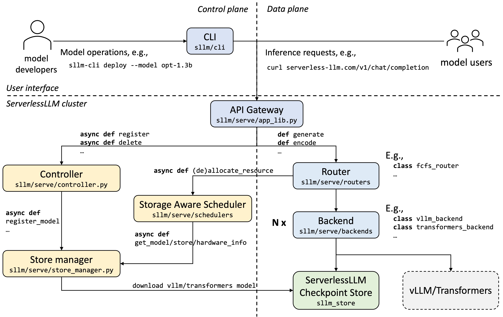

# ServerlessLLM v0.5.0 architecture walkthrough

## **ServerlessLLM (SLLM) Architecture Overview**

ServerlessLLM (SLLM, pronounced “slim”) achieves low-latency, serverless inference for LLMs through two key components: **sllm-serve** and **sllm-store**. *sllm-serve* is a serving platform that manages auto-scaling, load-balancing, and resource allocation for deployed LLMs over a distributed GPU cluster. *sllm-store*, built in C++, serves as a high-performance checkpoint store optimized for cold-start with efficient model loading and caching.

This article will walk you through the system architecture of *sllm* and aims to answer the following questions:

- What happens after deploying a model in a ServerlessLLM cluster?
- How is an inference request served, especially when a cold start is triggered?
- How does ServerlessLLM save and load model checkpoints efficiently?
- Which files should be modified to debug, add, or improve specific features (e.g., new load-balancing or auto-scaling algorithms, new inference backends, or GenAI models)?

The goal is to offer a clear picture of how ServerlessLLM functions under the hood, providing insights that will help readers both understand the architecture and potentially contribute to its development.

### ServerlessLLM Serve

The figure above provides an overview of ServerlessLLM Serve, split into control and data planes (left and right halves, respectively). The control plane on the left handles components such as the controller, store manager, and storage-aware scheduler, which manage cluster status and model lifecycle. The data plane on the right processes inference requests.

*sllm-serve* interacts with model developers and users via an API gateway. This gateway routes control messages to the controller and sends inference requests to the corresponding router.

Next, we will walk through this step-by-step from a user’s perspective.

**Step 1: Deploy an LLM**

Model developers deploy a model using *sllm-cli* by specifying a model name on the HuggingFace hub. Upon receiving the model registration request, the controller processes configurations such as backend choice (e.g., https://github.com/huggingface/transformers or https://github.com/vllm-project/vllm), auto-scaling settings (e.g., concurrency limits, minimum/maximum instances), and resource requirements (e.g., CPU and GPU allocation).

Once configured, the controller creates a router for the model and registers the model’s checkpoint with the store manager. The store manager determines an initial server location for downloading model checkpoints, then instructs *sllm-store* to download and convert the model into the *sllm* format. This approach ensures the model is ready for rapid loading and minimal latency when scaling up or during cold starts.

**Step 2: Query the LLM (Simple Case, No Cold Start)**

When a model inference request is received, the API gateway routes it to the corresponding model router. The router selects one of the existing backend instances and forwards the request. Each backend instance operates on one or more dedicated GPUs within a shared server, processing the inference request with an inference engine (such as *Transformers* or *vLLM*) and returning the result to the client.

**Step 3: Query the Model with Cold Start**

When traffic exceeds current capacity, the router scales up by creating additional backend instances. In a cold start scenario, the router sends a resource allocation request to the storage-aware scheduler, which selects suitable server based on model information (e.g., model size), hardware specs (e.g., PCIe and disk bandwidth), and storage status (e.g., whether the model is stored on the server’s local disks or host memory).

### ServerlessLLM Store

ServerlessLLM Store accelerates checkpoint loading with a cold-start optimized format and a dedicated checkpoint manager running on each GPU server. ServerlessLLM Store is accessible through a two level Python API: a lower-level PyTorch API for saving and loading a PyTorch `state_dict` and a higher-level API for inference libraries like *Transformers* and *vLLM*, built on top of the PyTorch API.

To illustrate, let’s walk through two steps: 1) saving a *Transformers* pre-trained model into the *sllm* cold-start optimized format, and 2) loading the *sllm* checkpoint to recover a *Transformers* pre-trained model.

**Step 1: Save a Model**

The model saving function (`save_model`) takes a pre-trained model (i.e., `transformers.PreTrainedModel`) and an output path as inputs. It first saves model metadata (such as model configuration) using *Transformers*’ built-in API, then calls the PyTorch API (`sllm_store.torch.save_dict`) to save the model’s `state_dict` (i.e., tensors) to disk.

The `save_dict` function invokes the checkpoint parser, which saves each tensor's data in a binary file while recording its offset and metadata in an index file. This setup enables efficient retrieval during model loading.

**Step 2: Load a Model**

The model loading function (`load_model`) takes a model path as input and returns a *Transformers* pre-trained model. It initializes the model class with saved metadata configurations and concurrently calls the PyTorch API (`sllm_store.torch.load_dict`) to load the tensors.

The PyTorch API allocates GPU memory for each tensor, calling the standalone checkpoint manager (via gRPC) to load tensor data into designated addresses. Simultaneously, `load_model` uses the checkpoint parser to restore tensors in specified GPU memory locations based on the saved tensor metadata.

Before returning the model, a final sync call is sent to the checkpoint manager to ensure all data has loaded correctly.

### **Conclusion and Future Work**

ServerlessLLM is evolving rapidly, with version 0.6.0 set to introduce further architectural advancements.

In the next blog post, we’ll demonstrate a deployment example of Serverless RAG. Future posts will also explore specific topics in greater detail, including the scheduling algorithm, cold-start optimized checkpoint format, and the efficient multi-tier checkpoint loading pipeline.