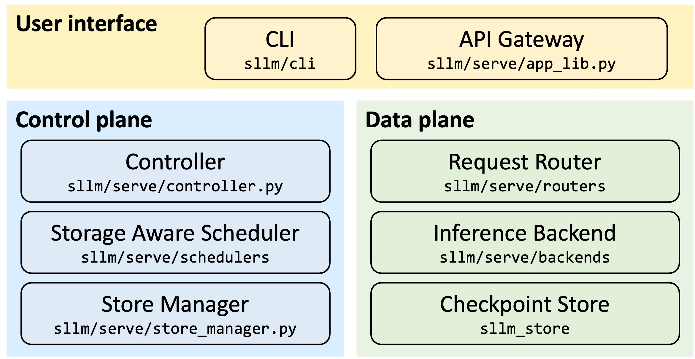
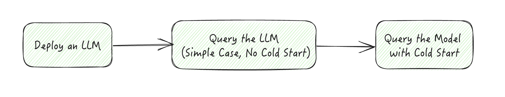
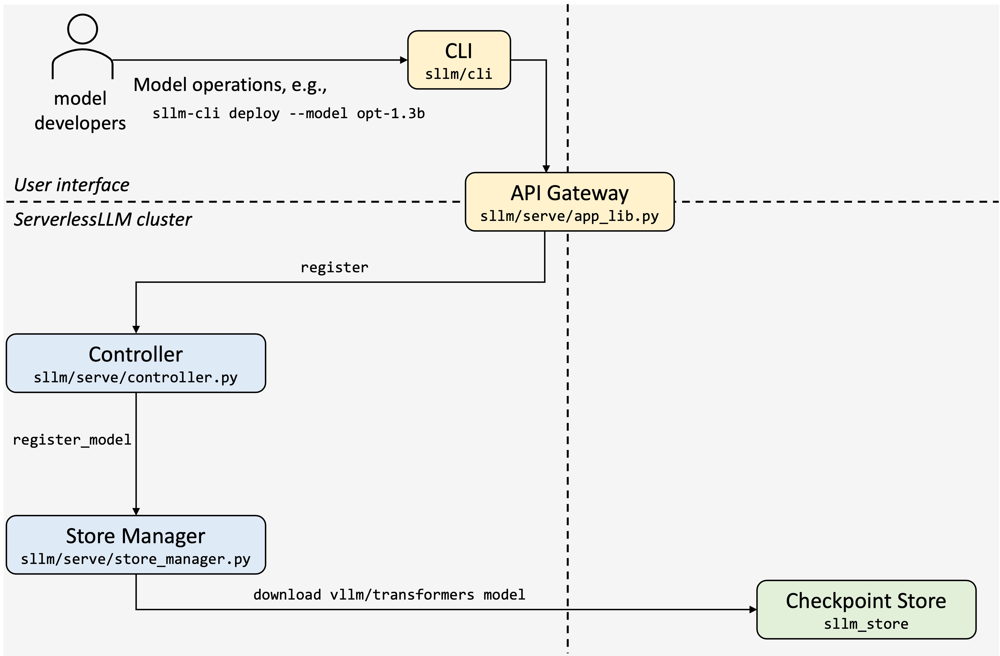
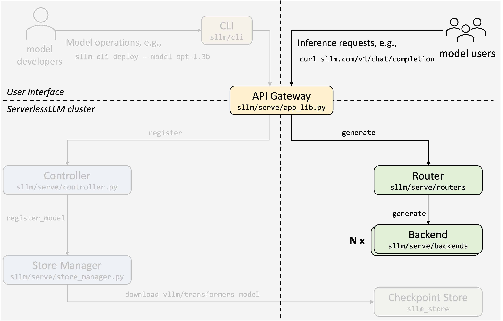
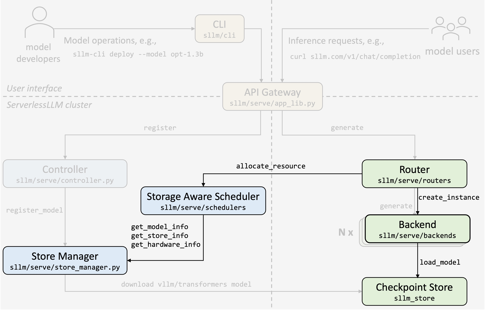
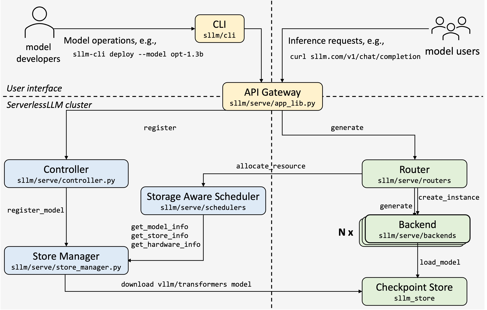
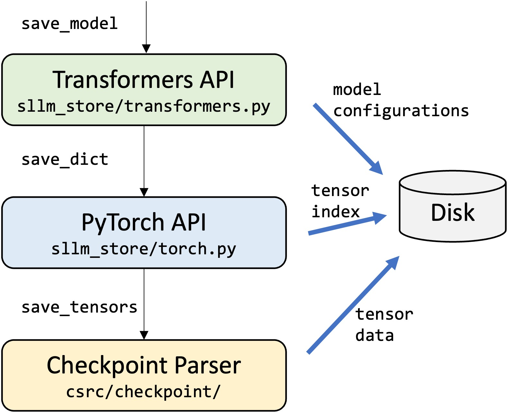
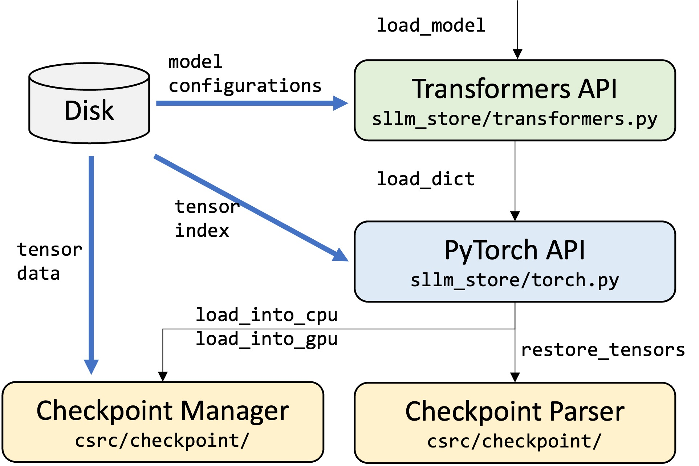

# ServerlessLLM Architecture Overview

## Table of Contents

- [ServerlessLLM Architecture Overview](#serverlessllm-architecture-overview)
  - [Table of Contents](#table-of-contents)
  - [Introduction](#introduction)
  - [ServerlessLLM Store](#serverlessllm-store)
  - [Conclusion and Future Work](#conclusion-and-future-work)

## Introduction

ServerlessLLM (SLLM, pronounced “sllm”) enables low-latency, serverless LLM inference via two core components: **sllm click** and **sllm-store**. The sllm CLICK provides a unified interface to manage serverless LLM services. It supports starting the system, deploying and deleting models, and checking service status with simple commands.. *sllm-store*, built in C++, serves as a high-performance checkpoint store optimized for cold-start with efficient model loading and caching.

This article will walk you through the system architecture of *sllm* and aims to answer the following questions:

- What happens when we **deploy a model** in our cluster?
- How is an **inference** request served?
- How to handle **cold start**?
- How do we **save and load model** checkpoints?

The goal is to offer a clear picture of how ServerlessLLM functions under the hood, providing insights that will help readers both understand the architecture and potentially contribute to its development.

## ServerlessLLM Serve

  

The above figure outlines ServerlessLLM Serve, divided into three planes: user interface, control, and data.

- **User Interface**: Includes a CLI for model and cluster management and an API gateway that routes control messages to the controller and inference requests to the appropriate router.
- **Control Plane**: Contains the controller, storage-aware scheduler, and store manager, managing cluster status and model lifecycles.
- **Data Plane**: Comprises the request router, inference backend for processing requests, and checkpoint store for efficient model loading and caching.

We’ll next walk through these planes from a user’s perspective: first deploying an LLM on the control plane, then processing an inference request on the data plane without cold-start, and finally examining the cold-start process.

**Step 1: Deploy an LLM**

Starting with the control plane, model developers use *sllm* to deploy a model, specifying its name on the HuggingFace hub. Upon receiving the model registration request, the controller processes configurations such as backend choice (e.g., [Transformers](https://github.com/huggingface/transformers) or [vLLM](https://github.com/vllm-project/vllm)), auto-scaling settings (e.g., concurrency limits, minimum/maximum instances), and resource requirements (e.g., CPU and GPU allocation).

Once configured, the controller creates a router for the model and registers its checkpoint with the store manager. The store manager determines an initial server for downloading model checkpoints, then instructs *sllm-store* to download and convert the model into the optimized format. This approach ensures the model is ready for rapid loading and minimal latency during cold starts.

**Step 2: Query the LLM (Simple Case, No Cold Start)**

In the data plane, when a model inference request is received, the API gateway routes it to the corresponding model router. The router selects one of the available backend instances and forwards the request. Each backend instance operates on one or more dedicated GPUs within a shared server, processing the inference request with an inference engine (such as *Transformers* or *vLLM*) and returning the result to the client.

**Step 3: Query the Model with Cold Start**

In a cold-start scenario, when traffic exceeds capacity, the router scales up by creating additional backend instances. It issues a resource allocation request to the storage-aware scheduler, which selects an optimal server based on model details (e.g., size), hardware specifications (e.g., PCIe and disk bandwidth), and storage status (e.g., whether the model is stored on the server’s local disks or host memory). The request router then initiates a new inference backend, which loads the model from the checkpoint store before becoming available.

In summary, these steps illustrate how ServerlessLLM efficiently deploys, serves, and scales LLMs, achieving low-latency serverless inference even with frequent cold starts. The figure below illustrates the interplay between these components.

## ServerlessLLM Store

  

ServerlessLLM Store enables fast checkpoint loading with two core modules:

- A checkpoint parser that saves and restores model checkpoints in a cold-start optimized format (detailed in Step 1 below).
- A dedicated checkpoint manager on each GPU server that loads checkpoints into GPUs efficiently and caches frequently used ones in host memory.

Built on these core modules, ServerlessLLM Store offers a two-level Python API:

- A lower-level tensor API that saves and restore tensors for each specific deep learning library. For examples, PyTorch API for saving and loading a PyTorch `state_dict` .
- A higher-level model API, built on the tensor API, that saves and loads models for inference libraries like *Transformers* and *vLLM*.

To illustrate, let’s walk through two steps: 1) saving a *Transformers* pre-trained model into the *sllm* cold-start optimized format, and 2) loading the *sllm* checkpoint to restore a *Transformers* pre-trained model.

  

**Step 1: Save a Model**

  

The`save_model`function takes a *Transformers* pre-trained model and an output path as inputs. It first saves model configurations using *Transformers*’ built-in API, then calls the PyTorch API (`sllm_store.torch.save_dict`) to save the model’s `state_dict` in a cold-start optimized format.

The `save_dict` function uses the checkpoint parser via `save_tensors`, which saves each tensor’s data in a binary file and returns its offset within that file. After saving tensors, the `save_dict` function records tensor metadata and offsets to an index file. This setup enables efficient retrieval during model loading.

**Step 2: Load a Model**

  

The `load_model`function takes a model path as input and returns a *Transformers* pre-trained model. It initializes the model with saved configurations and concurrently calls the PyTorch API (`sllm_store.torch.load_dict`) to load the tensors.

The PyTorch API allocates GPU memory for each tensor, calling the standalone checkpoint manager (via gRPC) to load tensor data into designated addresses. Simultaneously, `load_model` uses the checkpoint parser to restore tensors based on the saved tensor metadata, inferring actual GPU memory addresses using the base GPU memory address and saved tensor offsets.

Before returning the model, a final sync call is sent to the checkpoint manager to ensure all data has loaded correctly.

## Conclusion and Future Work

In the next blog post, we’ll demonstrate a deployment example of Serverless RAG. Future posts will also explore specific topics in greater detail, including the scheduling algorithm, cold-start optimized checkpoint format, and the efficient multi-tier checkpoint loading pipeline.
