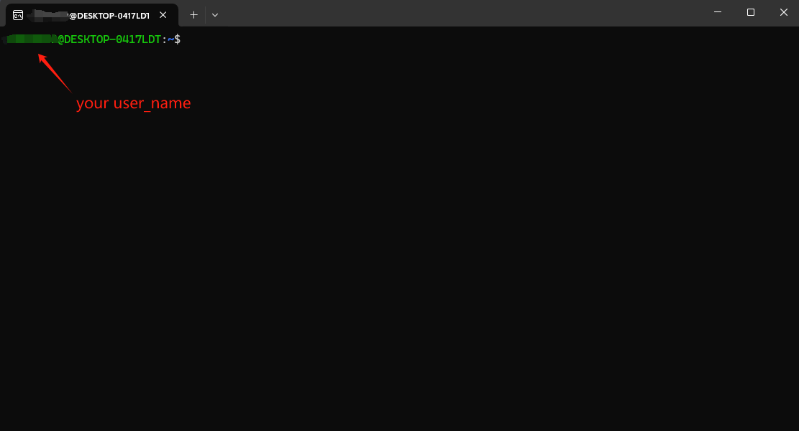
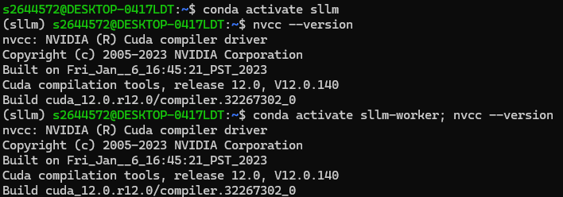

# Install ServerlessLLM on Windows Machines

To install the ServerlessLLM dependencies, Ubuntu 20.04 is required according to the installation guide. Some packages, such as `vllm`, cannot be installed natively on Windows. Therefore, a Linux environment is necessary. Windows Subsystem for Linux (WSL) provides a convenient way to run Linux on Windows machines.

## 1 Windows Subsystem for Linux
It is recommended to download the Ubuntu app from the Microsoft Store. This enables a fully functional Linux terminal environment.

Advantages:
Allows installation of all required dependencies.
Seamlessly integrates with Windows.

Limitations:
WSL does not support GUI applications by default.
Configuring variable paths can occasionally be challenging.

You can install Ubuntu from the Microsoft Store.


**Description**:
Install a complete Ubuntu terminal environment in minutes using WSL. This allows you to:
- Develop cross-platform applications.
- Enhance workflows for data science or web development.
- Manage IT infrastructure—all without leaving Windows.

For more details on Ubuntu WSL and Canonical's developer support, visit: [https://ubuntu.com/wsl](https://ubuntu.com/wsl).

### 1.2 Setting Up WSL
For a step-by-step video guide, check out this [YouTube tutorial](https://www.youtube.com/watch?v=sUsTQTJFmjs) by ProgrammingKnowledge. It covers the process in detail, including every button click.

If the installation is successful, your terminal should look like this:



---

## 2. Configuring WSL for ServerlessLLM

### 2.1 Checking Memory Status

If your configuration does not meet the requirements below, you need to update the `.wslconfig` file located in C:\Users\your_username\\. If this file does not exist, create it manually.
You can check the current memory status using:

```bash
free -h
```

The minimum setting to start `sllm-store-server` is
```bash
[wsl2]               # this line is a must-have
memory=5GB           # Limits VM memory
swap=2GB             # Sets swap file size
```
However, depending on the size of models you want to deploy, you need to increase the configuration accordingly in most cases. For example, the WSL environment must meet the following minimum memory requirements to deploy the sample model.

```bash
[wsl2]               # this line is a must-have
memory=16GB          # Limits VM memory
swap=8GB             # Sets swap file size
```


### 2.2 Applying Changes
Restart the WSL connection to apply changes:
```bash
wsl --shutdown
wsl
```

After this, proceed with installing ServerlessLLM using `pip install` as instructed in the installation guide. If everything is configured correctly, the installation should proceed without issues.

## Potential issues:

### 3.1 CUDA Issue

If you encounter an error such as
```vbnet
error while loading shared libraries: libcudart.so.12: cannot open shared object file: No such file or directory
```

Follow these steps:

1. Verify that CUDA v12 is correctly installed in both the ServerlessLLM and sllm-worker environments.
2. Use the following command to check the CUDA version:

```bash
nvcc --version
```
The output should look similar to this:



### 3.2 Folder Access Issue

If an error occurred while saving the model, like
```vbnet
No such file or directory: `./models/vllm`
```

This issue is likely due to the `./models` folder created in the WSL environment not being accessible. Run the following commands to diagnose the issue:

```bash
cd ServerlessLLM/examples/installation_on_windows/
python model_folder_checker.py
```

It will try to solve the access issue by deleting the inaccessible `./models` folder and creating a new one. If it encounters an error, like `Permission denied: Cannot delete the '~/models' folder.`, you can always check your home directory and force delete the inaccessible folder. Then, run `model_folder_checker.py` again.

```
ls -a # check if the models folder is red, meaning it is not accessible
rm -rf FOLDER_TO_BE_DELETED
```
