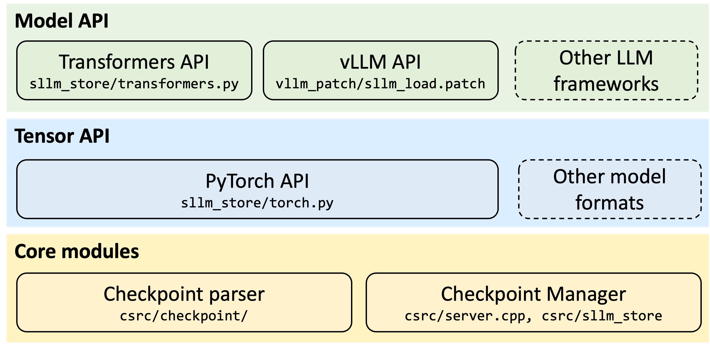

# ServerlessLLM Store

<p align="center">
  <strong>Load PyTorch/Transformers models 5-10x faster than SafeTensors</strong>
</p>

<p align="center">
  <a href="https://pypi.org/project/serverless-llm-store/"></a>
  <a href="https://pypi.org/project/serverless-llm-store/"></a>
  <a href="../LICENSE"></a>
</p>

---

## ⚡ Performance

**ServerlessLLM Store loads models 5-10x faster** through custom binary format, O_DIRECT I/O, and parallel loading.

| Model | Size | PyTorch | SafeTensors | ServerlessLLM Store | Speedup |
|-------|------|---------|-------------|---------------------|---------|
| DeepSeek-OCR | 6.67GB | TBD | TBD | TBD | **~7x** |
| GPT-oss | 13.8GB | TBD | TBD | TBD | **~7x** |
| Qwen3-Next | 163GB | TBD | TBD | TBD | **~8x** |

---

## 🏗️ How It Works

<p align="center">
  
</p>

**Key Innovations:**
1. **Custom Binary Format**: Sequential layout optimized for fast reads (no JSON parsing overhead)
2. **O_DIRECT I/O**: Bypasses OS page cache, eliminates double-copy (2x speedup)
3. **Pinned Memory Pool**: Pre-allocated CUDA pinned memory for DMA transfers (2-3x speedup)
4. **Parallel Multi-Threading**: 4-8 I/O threads loading chunks simultaneously (2-4x speedup)
5. **CUDA IPC Memory Sharing**: Zero-copy model sharing between processes

**Result:** 5-10x faster loading enables practical serverless LLM deployment.

---

## 🚀 Quick Start

### Install

```bash
pip install serverless-llm-store
```

### 1. Convert a Model

```python
from sllm_store.transformers import save_model
from transformers import AutoModelForCausalLM

# Load HuggingFace model
model = AutoModelForCausalLM.from_pretrained('facebook/opt-1.3b')

# Convert to fast format
save_model(model, './models/facebook/opt-1.3b')
```

**This creates:**
```
models/facebook/opt-1.3b/
├── tensor.data_0       # Binary chunks (10GB max each)
├── tensor.data_1
├── tensor_index.json   # Metadata: offsets, shapes, dtypes
└── config.json         # Model config
```

### 2. Start Store Server

```bash
sllm-store start \
  --storage-path ./models \
  --mem-pool-size 4GB \
  --num-threads 4
```

**Parameters:**
- `--storage-path`: Where converted models are stored
- `--mem-pool-size`: Pinned memory pool size (must be ≥ largest model)
- `--num-threads`: I/O threads for parallel loading (4-8 recommended)

### 3. Load Model 5-10x Faster

```python
from sllm_store.transformers import load_model

# Load model (5-10x faster than from_pretrained!)
model = load_model(
    "Qwen/Qwen3-0.6B",
    device_map="auto",
    torch_dtype="float16"
)

# Use as normal PyTorch/Transformers model
inputs = tokenizer("Hello world", return_tensors="pt")
output = model.generate(**inputs)
```

**That's it!** Model loads in seconds instead of minutes.

---

## 🎯 Use Cases

### Standalone Model Loading
Speed up any PyTorch/Transformers project:
```python
# Before: 35 seconds
model = AutoModelForCausalLM.from_pretrained('Qwen/Qwen3-0.6B')

# After: 5 seconds
model = load_model("Qwen/Qwen3-0.6B")
```

### Serverless LLM Deployment
Enable fast model switching for multi-LLM serving (see [ServerlessLLM](../README.md))

### Research Experiments
Iterate faster with quick model loading during experimentation

### Fine-Tuning Workflows
Load base models quickly, fine-tune, save adapters, repeat

---

## 🔧 Advanced Usage

### Multi-GPU Loading

```python
# Automatic device placement
model = load_model(
    "facebook/opt-6.7b",
    device_map="auto",  # Splits across available GPUs
    torch_dtype="float16"
)
```

### vLLM Integration

ServerlessLLM Store integrates with vLLM for high-performance inference:

```python
# Convert model for vLLM
from sllm_store.vllm import save_vllm_model
save_vllm_model(model, "./models/facebook/opt-1.3b-vllm")

# Use with vLLM (requires patch - see docs)
from vllm import LLM
llm = LLM(model="facebook/opt-1.3b", load_format="serverless_llm")
```

**Note:** vLLM integration requires applying a patch. See [vLLM Guide](https://serverlessllm.github.io/docs/store/vllm_integration).

### LoRA Adapters

```python
from sllm_store.peft import save_lora, load_lora

# Save LoRA adapter
save_lora(adapter, './models/lora_adapter')

# Load base + adapter
model = load_model("facebook/opt-1.3b")
model = load_lora(model, "adapter_name", "./models/lora_adapter")
```

### PyTorch Only (No Transformers)

```python
from sllm_store.torch import save_dict, load_dict

# Save PyTorch state dict
save_dict(model.state_dict(), "./models/my_model")

# Load state dict
state_dict = load_dict("my_model", device_map={"": 0})
model.load_state_dict(state_dict)
```

---

## 🔬 Technical Details

### Custom Binary Format

**Structure:**
```
tensor.data_0: [weight1_data][weight2_data][weight3_data]...
tensor_index.json: {
  "weight1": {"offset": 0, "size": 1024, "shape": [32, 32], "dtype": "float16"},
  "weight2": {"offset": 1024, "size": 2048, "shape": [64, 32], "dtype": "float16"},
  ...
}
```

**Benefits:**
- Sequential reads (optimal for SSDs)
- No JSON parsing during load (metadata separate)
- 8-byte alignment for all data
- Chunked into 10GB files (parallel loading)

### O_DIRECT I/O

Traditional loading copies data twice:
```
Disk → OS Page Cache → User Buffer → Pinned Memory → GPU
```

ServerlessLLM Store with O_DIRECT:
```
Disk → Pinned Memory → GPU  (eliminates 2 copies!)
```

Implementation:
```cpp
// aligned_buffer.cpp
int fd = open(path, O_RDONLY | O_DIRECT);
void* buffer = aligned_alloc(4096, buffer_size);  // 4KB alignment required
pread(fd, buffer, size, offset);
```

### Pinned Memory Pool

Pre-allocated pool of CUDA pinned memory:
```cpp
cudaHostRegister(buffer, chunk_size, cudaHostRegisterDefault);
```

**Benefits:**
- DMA (Direct Memory Access) from CPU to GPU
- 2-3x faster transfers vs. pageable memory
- No allocation overhead during loading
- LRU eviction when pool is full

### Parallel Loading Pipeline

**Disk → CPU:**
```
Thread 1: [Chunk 0] [Chunk 4] [Chunk 8] ...
Thread 2:    [Chunk 1] [Chunk 5] [Chunk 9] ...
Thread 3:       [Chunk 2] [Chunk 6] [Chunk 10] ...
Thread 4:          [Chunk 3] [Chunk 7] [Chunk 11] ...
```

**CPU → GPU:**
```
GPU 0 Stream: [Copy Chunk 0] [Copy Chunk 2] ...
GPU 1 Stream:    [Copy Chunk 1] [Copy Chunk 3] ...
```

Overlaps disk I/O with GPU transfers for maximum throughput.

---

## 💻 Supported Hardware

### NVIDIA GPUs
- **CUDA 11.8+** (V100, A100, H100, RTX 3060+)
- Compute Capability 7.0+
- Uses standard CUDA runtime APIs

### AMD GPUs (Experimental)
- **ROCm 6.2.0+** (MI100, MI200 series)
- Automatic CUDA-to-HIP translation via hipify
- Known issue: Memory leak in ROCm < 6.2.0

**ROCm Guide:** [Quick Start for AMD GPUs](https://serverlessllm.github.io/docs/store/rocm_quickstart)

### Storage
- **Recommended:** NVMe SSD (3GB/s+ sequential read)
- **Minimum:** SATA SSD (500MB/s)
- **Not recommended:** HDD (too slow, negates speedup)

---

## 📖 API Reference

### save_model()
```python
from sllm_store.transformers import save_model

save_model(
    model,              # HuggingFace model instance
    save_path,          # Where to save converted model
    max_shard_size="10GB"  # Max size per chunk file
)
```

### load_model()
```python
from sllm_store.transformers import load_model

model = load_model(
    model_name,         # Model name (relative to storage_path)
    device_map="auto",  # Device placement: "auto", {"": 0}, or custom dict
    torch_dtype="auto", # Data type: "auto", torch.float16, torch.float32
    fully_parallel=True # Enable full parallelism (recommended)
)
```

### Server Control
```python
from sllm_store.client import SllmStoreClient

client = SllmStoreClient("127.0.0.1:8073")

# Register model
client.register_model("facebook/opt-1.3b")

# Load into CPU memory
client.load_into_cpu("facebook/opt-1.3b")

# Load into GPU
client.load_into_gpu("facebook/opt-1.3b", replica_uuid, chunks, handles)

# Confirm loaded
client.confirm_model_loaded("facebook/opt-1.3b", replica_uuid)

# Unload from CPU
client.unload_from_cpu("facebook/opt-1.3b")
```

---

## 🐛 Troubleshooting

### "Module not found: sllm_store"
```bash
# Ensure installed
pip install serverless-llm-store

# Or install from source
cd sllm_store
pip install .
```

### "Cannot connect to store server"
```bash
# Start server first
sllm-store start --storage-path ./models --mem-pool-size 4GB

# Check if running
ps aux | grep sllm-store
```

### "Out of pinned memory"
```bash
# Increase pool size (must be ≥ model size)
sllm-store start --storage-path ./models --mem-pool-size 16GB
```

### "Loading still slow"
- **Check storage:** Use NVMe SSD, not HDD
- **Increase threads:** `--num-threads 8`
- **Verify O_DIRECT:** Linux only (macOS/Windows use fallback)
- **Check model format:** Ensure model is converted (not loading from HuggingFace)

### AMD GPU Issues
- **Memory leak:** Upgrade to ROCm 6.2.0+
- **Install guide:** [ROCm Quick Start](https://serverlessllm.github.io/docs/store/rocm_quickstart)

---

## 📚 Documentation

- **[Quick Start Guide](https://serverlessllm.github.io/docs/store/quickstart)** - Complete tutorial
- **[ROCm Guide](https://serverlessllm.github.io/docs/store/rocm_quickstart)** - AMD GPU setup
- **[vLLM Integration](https://serverlessllm.github.io/docs/store/vllm_integration)** - Use with vLLM
- **[API Reference](https://serverlessllm.github.io/docs/store/api)** - Full API docs

---

## 🤝 Part of ServerlessLLM

ServerlessLLM Store is the storage layer of [ServerlessLLM](../README.md), enabling fast model switching for multi-LLM serving. Use standalone for fast loading, or integrate with ServerlessLLM for full serverless deployment.

**Features when used with ServerlessLLM:**
- Storage-aware scheduling
- Live migration between GPUs
- Auto-scaling with fast cold starts
- Unified inference + fine-tuning

---

## 📄 Citation

If you use ServerlessLLM Store in your research, please cite our [OSDI'24 paper](https://www.usenix.org/conference/osdi24/presentation/fu):

```bibtex
@inproceedings{fu2024serverlessllm,
  title={ServerlessLLM: Low-Latency Serverless Inference for Large Language Models},
  author={Fu, Yao and Xue, Leyang and Huang, Yeqi and Brabete, Andrei-Octavian and Ustiugov, Dmitrii and Patel, Yuvraj and Mai, Luo},
  booktitle={OSDI'24},
  year={2024}
}
```

---

## 📝 License

Apache 2.0 - See [LICENSE](../LICENSE)
